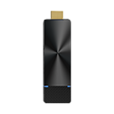
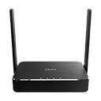

# Die EZCast Pro Serie

EZCast Pro ist ein Präsentationssystem zum kabellosen Übertragen von Bildschirminhalten auf ein Public Display oder einen Projektor.

Die EZCast Pro Serie gibt es in zwei Varianten: 

	
	

		
		
Der EZCast Pro Stick II dient als Empfänger bei einer kabellosen Präsentation und wird über HDMI mit einem Bildschirm oder einem Projektor verbunden. Anschließend können Sie Ihren aktuellen Bildschirminhalt übertragen.

		
<a href="pro-stick-d10/intro">Zum EZCast Pro Stick II</a>

	

	
	

		
		
Die EZCast Pro Box II verfügt über alle grundlegenden Funktionen des Stick und viel mehr. Die EZCast Pro Box II wird über das mitgelieferte USB-Ladegerät mit Strom versorgt. Die Box kann dann entweder über WLAN oder Netzwerkkabel (PoE) in Ihr Netzwerk integriert werden, so dass Sie Ihren Bildschirm übertragen und Internetinhalte streamen können. Die Pro Box II ist außerdem mit einer externen Antenne für eine verbesserte kabellose Reichweite und einer Befestigungsmöglichkeit über VESA ausgestattet und unterstützt Touch-Back-Funktion von Ihrem Display.

		
<a href="pro-box-b10/intro">Zur EZCast Pro Box II</a>

	

Eine Entscheidungshilfe:

!!! tip "Der EZCast Pro Produktvergleich"

    [![Produktvergleich][1]{: align=left }][2] Nicht ganz sicher, welches Gerät für Sie das passende ist?   
	Unser **Produktvergleich zur EZCast Pro Serie** hilft ihnen dabei.
	
	[Zum Produktvergleich (PDF)][2]

  [1]: assets/img/product-comparison.png
  [2]: https://download.stueber.de/doc/de/ezcastpro/ezcastpro.produktvergleich.de.pdf
